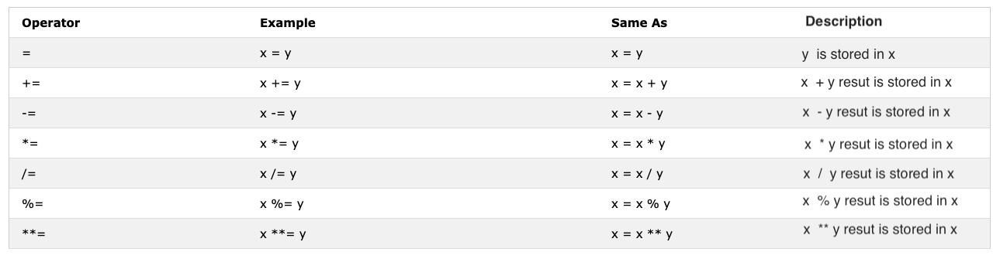

## INTRODUCTION TO JAVASCRIPT

## Table of contents

- [Overview](#overview)
    - [Induction](#induction)
    - [Introduction](#introduction)
- [Adding JavaScript to a Web Page](#adding-javascript-to-a-web-page)
- [Data Types](#data-types)
- [Variables](#variables)
- [Useful Resources](#useful-resources)
- [Author](#author)

## Overview

### Induction
- We will be creating a Weather API project. The Portfolio Project will be found at the Root Repository.

### Introduction
- JavaScript is the Scripting Language invented by Brendan Eich in 1995 for the Web and designed to update and change both HTML and CSS.

- JavaScript can be used for calculation, manipulation of content, and validating data.

## Adding JavaScript to a Web Page
- Inline script
- Internal script
- External script
- Multiple External scripts

```HTML
<!DOCTYPE html>
<html lang="en">
  <head>
    <title>Multiple External Scripts</title>
  </head>
  <body>
    <!-- Inline Script -->
    <button onclick="alert('Welcome to 30DaysOfJavaScript!')">Click Me</button>

    <!-- Internal Script -->
    <script>
      console.log('Welcome to 30DaysOfJavaScript')
    </script>

    <!-- External JavaScript, Multiple External scripts -->
    <script src="./helloworld.js"></script>
    <script src="./introduction.js"></script>
  </body>
</html>
```

## Data Types

### Primitive data types
- They are immutable(non-modifiable) data types. Once a primitive data type is created we cannot modify it, they include:

**Number**
- negative, zero and positive ( -3, -2, -1, 0, 1, 2, 3)
- Float-point numbers, decimal number (-3.5, -2.25, -1.0, 0.0, 1.1, 2.2, 3.5)

**String**
```JS
let string1 = 'I hope you are enjoying the first day'
let string2 = `We can also create a string using a backtick`
```

**Boolean**
```JS
true // if the light is on, the value is true
false // if the light is off, the value is false
```

**Undefined**
- If we don't assign a value to a variable, the value is undefined. In addition to that, if a function is not returning anything, it returns undefined.

```JS
let firstName
console.log(firstName) // undefined, because it is not assigned to a value yet
```

**Null**
- Null means an empty value.

**Symbol**

### Non-primitive data types
- They are modifiable or mutable. We can modify the value of non-primitive data types after it gets created.

**Arrays**
- An array is a list of data values in a square bracket. Arrays can contain the same or different data types. 
- Array values are referenced by their index. In JavaScript array index starts at zero. I.e., the first element of an array is found at index zero, the second element at index one, and the third element at index two, etc.

```JS
let nums = [1, 2, 3]
nums[0] = 10

console.log(nums)  // [10, 2, 3]
```

**Object**

### Changing Data Type (Casting)
- Casting: Converting one data type to another data type. We use parseInt(), parseFloat(), Number(), + sign, str() When we do arithmetic operations string numbers should be first converted to integer or float if not it returns an error.

### Operators in Javascript
**Assignment Operator**


**Arithmetic Operators**
```JS
// Addition(+): a + b
// Subtraction(-): a - b
// Multiplication(*): a * b
// Division(/): a / b
// Modulus(%): a % b
// Exponential(**): a ** b
```

**Comparison (Relational) Operators**


**Logical Operators**
- The following symbols are the common logical operators: &&(ampersand) , ||(pipe) and !(negation). The && operator gets true only if the two operands are true. The || operator gets true either of the operand is true. The ! operator negates true to false and false to true.

**Increment Operator**
```JS
// pre-increment
let count = 0
console.log(++count) // 1
console.log(count) // 1

// Post-increment
let count = 0
console.log(count++) // 0
console.log(count) // 1

// Pre-decrement
let count = 0
console.log(--count) // -1
console.log(count)  // -1

// Post-decrement
let count = 0
console.log(count--) // 0
console.log(count)   // -1
```

**Ternary Operators**
- Another way to write conditionals is using ternary operators
```JS
let isRaining = true
isRaining
  ? console.log('You need a rain coat.')
  : console.log('No need for a rain coat.')
```

**Bitwise Operators**

**Special Operators**


## Variables
- Variables are containers of data. Variables are used to store data in a memory location.
- Variable name should not begin with a number.
- Variable name does not allow special characters except dollar sign and underscore.
- Variable name follows a camelCase convention.
- Variable name should not have space between words.

**var**
- variable that changes at a different time

**let**

**const**
- variable data does not change at all

## Introduction to Javascript
- **Methods** - String, Number, Math

### Conditional Statements + Control Flow
- **Statements** - if, if-else, else-if, ternary operators

### User Input
- Alerts
- Confirm
- Prompt

### Loops
- Entry Controlled loops - the test condition is tested before entering the loop body. For Loop and While Loop are entry-controlled loops.

- Exit Controlled Loops: the test condition is tested or evaluated at the end of the loop body. Therefore, the loop body will execute at least once, irrespective of whether the test condition is true or false. The do-while loop is exit controlled loop.

### Scope
- Global Scope
- Local Scope - block scope, function scope

### Functions
- Function Declaration and Function Expression, Anonymous Function, Arrow Function
- Function Call

### Objects
- properties or methods
- 'this' keyword refers to the object that is currently executing the code. In other words, this refers to the object that the function is a method of, or the object that called the function.
- class, super, extends - ES6
- Inheritance
- Object prototypes

## Useful Resources
- [30DaysOfJavascript](https://github.com/Asabeneh/30-Days-Of-JavaScript/tree/master)
- [MDN Javascript](https://developer.mozilla.org/en-US/docs/Web/JavaScript)
- [https://github.com/mbeaudru/modern-js-cheatsheet](https://github.com/mbeaudru/modern-js-cheatsheet)

**More content to be added, feel free to add any engaging content**

## Author

- Momanyi Brian - [Portfolio](https://portfolio-momanyi-brian.vercel.app)