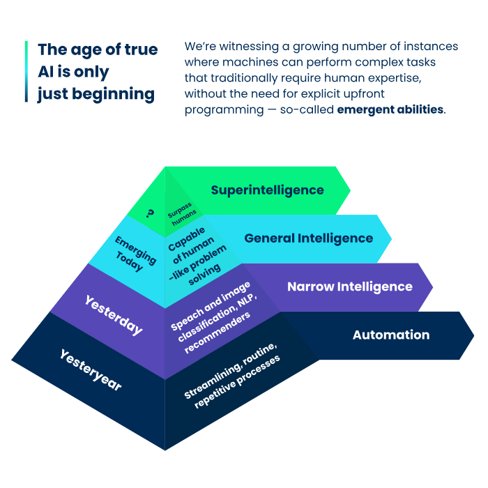
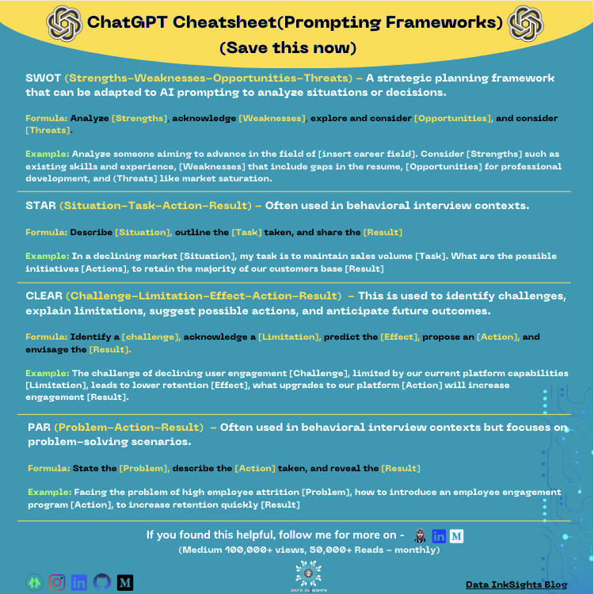

## ALX AiCE - AI Career Essentials

## Table of contents

- [Overview](#overview)
  - [Karibu](#karibu)
- [Introduction to AI](#introduction-to-ai)
- [Need to know about AI](#need-to-know-about-ai)
- [What is AI](#what-is-ai)
- [How does AI work](#how-does-ai-work)
- [AI is Built on Robust Data](#ai-is-built-on-robust-data)
- [Artificial Intelligence Buzzwords](#artificial-intelligence-buzzwords)
- [Generative AI or GenAI](#generative-ai-or-genai)
- [Large Language Models, or LLMs](#large-language-models-or-llms)
- [GPT Models](#gpt-models)
- [AI Prompting](#ai-prompting)
- [Author](#author)

## Overview

### Karibu
Throughout this course, we’ll explore AI and its incredible potential to enhance our skills, empowering us to become digital leaders.

## Introduction to AI
- Understand AI and harness its capabilities to create and innovate, making your AI-driven projects come to life.
- Transform raw ideas into captivating digital creations using AI tools, showcasing your newly acquired skills on social media to engage and inspire your network.
- Equip yourself to critically navigate the complex landscape of AI, from risks to the technical nuances of AI model training, preparing you to make informed decisions in your future AI endeavors.

## Need to know about AI
- AI is as old as our grandparents. It has been around longer through the use of artificial neural networks.
- AI can not think or experience emotions and make decisions based on feelings. 
- AI making things up (AI Hallucination). AI uses probability to predict the next word, sentence, or paragraph.
- AI can sound racist and sexist. AI systems are only as unbiased as the data they are trained on.
- AI has incredible potential. Used to enhance and speed up work creating efficiency in work place.

## What is AI?
Artificial Intelligence (AI) refers to the simulation of human intelligence in machines programmed to think like humans and mimic their actions. The term may also be applied to any machine that exhibits traits associated with a human mind, such as learning and problem-solving.

## How does AI work?
AI combines large amounts of data with fast, iterative processing and intelligent algorithms, allowing the software to learn automatically from patterns or features in the data.

- Machine Learning. This allows computers to create models that can analyze data and make decisions or predictions. It uses techniques from different fields, such as neural networks, statistics, and more. The key is that machine learning can automatically discover patterns and insights from data without being told exactly what to look for.

- Neural Networks. These are particular types of machine learning models designed to work like the human brain. They consist of units (similar to brain cells) that pass information to each other. This setup helps the system process information in complex ways, going over the data multiple times to find connections and make sense of it.

- Deep Learning. A more advanced form of neural networks, deep learning involves many layers of these units. This structure allows the system to learn from vast amounts of data and understand very intricate patterns. It’s particularly good at tasks like recognizing images and understanding spoken words, thanks to the increased computing power and improved methods for teaching these systems.

## AI is Built on Robust Data
Robust data foundation where each layer is as crucial as the next. This pyramid illustrates the systematic approach that underpins AI, from the collection of high-quality data to the analysis and learning performed by deep learning models.

## Artificial Intelligence Buzzwords
- AI-generated Content. Any piece of written, audio, or visual media that was created partially or completely by an artificial intelligence-powered tool.

- AI Hallucination. When your question stumps an AI, it doesn’t always admit that it doesn’t know the answer. So, instead of not giving an answer, it’ll make one up that it thinks you want to hear. This made-up answer is known as an AI hallucination.

- Black Box. You don’t know how the AI arrived at its conclusions. The AI completely hides its reasoning process. A black box can be a problem if you’d like to doublecheck the AI’s work.

- Explainable AI – *or white box* – is the opposite of black box AI. An explainable AI model always shows its work and how it arrived at its conclusion. Explainable AI can boost your confidence in the final output because you can doublecheck what went into the answer.

- Deepfake. Deepfake is the manipulation of a photo, video, or audio clip to portray events that never happened.

- Deep Learning. The closer an AI’s thinking process is to the human brain, the more accurate the AI is likely to be. Deep learning involves training an AI to reason and recall information like a human, meaning that the machine can identify patterns and make predictions.

- Machine Learning. Machine learning is integral to AI, because it lets the AI learn and continually improve. Without explicit instructions to do so, machine learning within AI allows the AI to get smarter the more it’s used. 

- Generative AI. Generative AI is the type of artificial intelligence that powers many of today’s mainstream AI tools, like ChatGPT, Bard, and Craiyon. Like a sponge, generative AI soaks up huge amounts of data and recalls it to inform every answer it creates. 

- Responsible AI. People must not only use AI responsibly, but the people designing and programming AI must do so responsibly, too. Technologists must ensure that the data the AI depends on is accurate and free from bias. This diligence is necessary to confirm that the AI’s output is correct and without prejudice.

- Sentient. Someone or some thing is aware of feelings, sensations, and emotions. AI is not sentient. It doesn’t empathize or understand the true meanings of happiness, excitement, sadness, or fear.

- Supervised Machine Learning. It uses labeled data to train an algorithm/model to predict unknown data accurately. It involves inputting data associated with output labels and then training the algorithm on this data to recognize complex patterns in it.

- Unsupervised Machine Learning. Unsupervised Learning focuses on finding patterns and structures in data without relying on labeled data. It’s an approach to discovering hidden connections and valuable insights from large datasets.

- Reinforcement Machine Learning. Reinforcement Learning uses decision-making algorithms to learn from repeated interactions with an environment.

- GPT (Generative Pre-trained Transformer). It is a type of transformer-based model that excels in generating text that closely resembles human writing.

- LLM (Large Language Model). It refers to an AI model that has been trained on vast datasets of text to understand and generate language that closely resembles human writing. These models leverage deep learning techniques to process and produce text, excelling in grasping the nuances, context, and complexities of language

## Generative AI or GenAI
The major change that supercharged the development of generative AI, especially in creating smart systems like ChatGPT was Transformer architecture.

Transformer architecture introduced in 2017, helped machines better understand and organize information by focusing on the importance of words no matter where they appear in a sentence. For instance, it could tell the difference between “bank” as in a place where money is kept and “bank” as the side of a river.

Transformer architecture also allows AI systems to handle a lot of information at once and learn from it much quicker than before. This was a huge step, allowing it to perform complex tasks that seem more human-like.

Along with the transformer, we also now have:
- More Data: We generate massive amounts of digital content daily, providing a rich learning ground for AI.
- Better Algorithms: Improvements in algorithms, especially those related to machine learning and neural networks, have made AI smarter and faster.
- Increased Computing Power: More powerful computers can process information quicker, making training AI on large datasets feasible.

## Large Language Models, or LLMs
These are advanced AI systems that process and generate human-like text.
These models are trained on vast amounts of text data to recognize language patterns and produce responses that mimic human conversation. They can write essays, answer questions, translate languages, and even create poetry.

## GPT Models
OpenAI launched Generative Pre-trained Transformers, or GPTs, in November 2023. GPTs are custom versions of ChatGPT that users can create for a specific purpose or task. Users can also publish and share the GPTs they develop so that others can use them.

The way we interact with machine learning models has changed a lot thanks to GPTs. At first, GPTs were primarily text-based, focusing on general tasks and questions, but now they can do so much more. There are specialized models that cater to different needs, from creative graphic design to research to coding.

## AI Prompting
It is crafting specific inputs to guide AI responses accurately. Providing AI with a context or a cue that guides its responses or actions. It involves more than asking questions; it’s about crafting inputs that are designed to deliver the most informative, relevant, and desired output from an AI system.

Applications of Prompting
- Information Retrieval: Crafting prompts to retrieve specific information or data.
- Creative Generation: Using prompts to inspire AI to generate creative content like music, art, or writing.
- Problem Solving: Guiding AI to help solve technical, mathematical, or logical problems.
- Decision Support: Prompting AI to analyze data and provide decision-making support.

Six Building Blocks of a Good Prompt
- Task: Always start with a clear action verb and specify the exact output you’re seeking
- Context: Provide necessary background information that defines the scenario or requirement. *Background, what success looks like, what environment they are in*
- Exemplars: Include examples to guide the AI’s response style and content accuracy.
- Persona: Define who the AI should emulate, such as a coach or a technical expert, to align the tone and style of the output.
- Format: Envision and dictate the output structure, whether it’s an essay, list, or report.
- Tone: Decide on the emotional undertone or professional demeanor the response should convey.

**More content to be added, feel free to add any engaging content**

## Author
- Momanyi Brian - [Portfolio](https://portfolio-momanyi-brian.vercel.app)