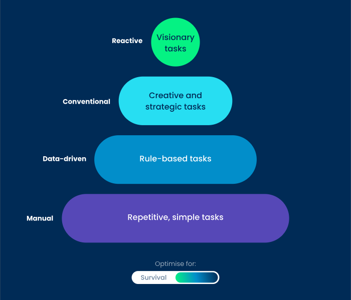
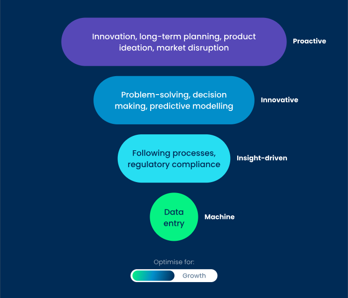

## ALX AiCE - AI Career Essentials

## Table of contents

- [Overview](#overview)
  - [Karibu](#karibu)
- [Will AI Take My Job?](#will-ai-take-my-job)
- [The Cost of Replacing a Job with AI](#the-cost-of-replacing-a-job-with-ai)
- [Personal Branding](#personal-branding)
- [Author](#author)

## Overview

### Karibu
Throughout this course, we’ll explore AI and its incredible potential to enhance our skills, empowering us to become digital leaders.

## Will AI Take My Job?
**What You’ll Learn:**
- Discover the Economic Impact of AI on Employment. Discover how AI affects job markets, including understanding which jobs are likely to be automated and the economic implications of replacing human labor with AI.
- Identify Vulnerabilities and Unlock Opportunities in AI Integration. Uncover which professions are most at risk from AI automation and learn strategic methods to leverage AI for growth instead.
- Leverage AI for Growth. Harness AI tools to enhance productivity and career development.

## The Cost of Replacing a Job with AI
- Data limits refer to the vast amounts of information AI needs to learn and make decisions. This data isn’t just large in volume but also needs to be managed and stored, which can be costly.
- Computing power to train AI is the intense processing power required to teach AI how to perform tasks.
- Computing power to run AI is the ongoing energy AI requires to operate daily.

## The Future of Work with AI

## Personal Branding
- Goal of crafting a personal branding is to align the impression that you'd like to make to the impression you're actually making. Helps figure out who you are and what you care about.

***ABOUT MOMANYI***

- You have recently graduated from university with a Bsc.IT and a skillset in Front end Development able to craft attractive Web Designs and Develop using React and Next JavaScript Frameworks, Django and WordPress.
You are currently building your personal brand, including cover letter, resume, LinkedIn profile

- Take a moment to reflect on your personal brand. What are the key strengths and skills that make you unique? Write down three qualities or achievements that best represent your brand, and think about how you can showcase these in your daily interactions and online presence.

- 

## Author
- Momanyi Brian - [Portfolio](https://portfolio-momanyi-brian.vercel.app)